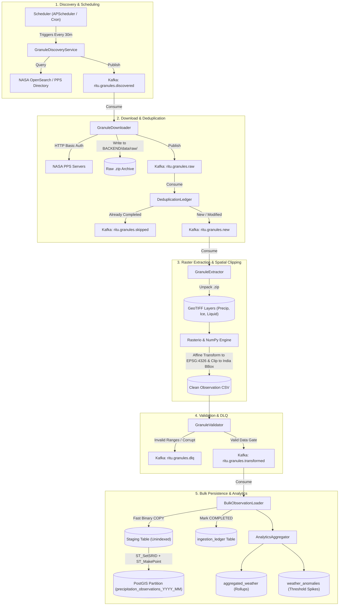

# NASA IMERG Weather Data Ingestion Pipeline Architecture

This document provides a comprehensive technical overview of the NASA GPM IMERG weather data ingestion, transformation, and persistence pipeline implemented in the **RITU / TATVA** platform.

---

## 1. System Architecture Overview

The pipeline employs an **event-driven, reactive microservices architecture** orchestrated via **Apache Kafka (KRaft)** with persistence in **PostgreSQL 16 + PostGIS**.



---

## 2. Pipeline Stages & Technical Implementation

### Stage 1: Granule Discovery (`discovery.py`)
- **Module:** `app.ingestion.discovery.GranuleDiscoveryService`
- **Schedule:** Automated every 30 minutes via `app.scheduler.scheduler_service` or manual trigger via `POST /api/v1/ingestion/trigger`.
- **Target Products:** NASA GPM IMERG GIS granules (30-minute, 3-hour, 1-day, 3-day, 7-day).
- **Discovery Flow:**
  1. Queries the NASA PMM Publisher OpenSearch JSON API (`https://pmmpublisher.pps.eosdis.nasa.gov/opensearch`).
  2. Falls back to scraping the NASA PPS directory listing (`https://jsimpsonhttps.pps.eosdis.nasa.gov/text/imerg/gis/{year}/{month}/`).
  3. Parses observation timestamps from filenames (e.g. `3B-HHR-L.MS.MRG.3IMERG.20260905-S083000-E085959...`).
- **Kafka Event:** Publishes `GranuleDiscoveredMessage` to `ritu.granules.discovered`.

---

### Stage 2: Streaming Download & Checksum (`downloader.py`)
- **Module:** `app.ingestion.downloader.GranuleDownloader`
- **Authentication:** HTTP Basic Auth with registered NASA Earthdata / PPS credentials.
- **Concurrency:** Managed by an async bounded semaphore (`MAX_CONCURRENT_DOWNLOADS=4`).
- **Data Integrity:** Computes SHA-256 hash incrementally during disk stream to `BACKEND/data/raw/{filename}`.
- **Kafka Event:** Publishes download metadata and SHA-256 checksum to `ritu.granules.raw`.

---

### Stage 3: Deduplication & Ledger Evaluation (`deduplication.py`)
- **Module:** `app.ingestion.deduplication.DeduplicationLedger`
- **Database Table:** `ingestion_ledger`
- **Idempotency Logic:**
  - If `granule_id` and SHA-256 match an existing `COMPLETED` record, the file is skipped and routed to `ritu.granules.skipped`.
  - If new or previously failed, updates status to `NEW` and routes to `ritu.granules.new`.

---

### Stage 4: Raster Extraction & Geospatial Transformation (`extractor.py`, `converter.py`)
- **Extraction (`granule_extractor.extract_zip`):** Unpacks the raw `.zip` archive into GeoTIFF raster bands:
  - `precipitation` (calibrated rainfall rate in mm/hr)
  - `liquid`, `ice`, `liquidPercent`
  - `numPrecipHalfHour`, `numValidHalfHour`
- **Coordinate Meshgrid:** Reads the GeoTIFF affine transform ($a, b, c, d, e, f$) to calculate exact pixel center coordinates:
  $$\text{Longitude} = c + (\text{col} + 0.5) \cdot a + (\text{row} + 0.5) \cdot b$$
  $$\text{Latitude} = f + (\text{col} + 0.5) \cdot d + (\text{row} + 0.5) \cdot e$$
- **Spatial Bounding & Clipping (`CLIP_TO_INDIA=true`):**
  $$\text{Latitude} \in [6.0^\circ\text{N}, 37.5^\circ\text{N}], \quad \text{Longitude} \in [68.0^\circ\text{E}, 97.5^\circ\text{E}]$$
- **NoData Filtering:** Replaces negative values (e.g. NASA's $-9999.0$ NoData flag) with `NaN` / `0.0`.
- **Output:** Standardized tabular observation CSV saved to `BACKEND/data/transformed/{granule_id}.csv`. Extracted GeoTIFF files are cleaned up immediately to minimize disk usage.

---

### Stage 5: Quality Gate & Validation (`validator.py`)
- **Module:** `app.ingestion.validator.GranuleValidator`
- **Integrity Checks:**
  - Required headers presence.
  - Coordinate bounds verification: $\text{Lat} \in [-90, 90]$, $\text{Lon} \in [-180, 180]$.
  - Meteorological bounds: $\text{Precipitation} \in [0.0, 1000.0]$ mm/hr, $\text{Liquid Percent} \in [0.0, 100.0]$.
  - Row count threshold checks.
- **Routing:** Valid datasets emit to `ritu.granules.transformed`; invalid datasets emit to Dead Letter Queue `ritu.granules.dlq` with status `FAILED`.

---

### Stage 6: High-Performance PostGIS Bulk Loader (`loader.py`)
- **Module:** `app.ingestion.loader.BulkObservationLoader`
- **Two-Phase Loading Architecture:**
  1. **Direct CSV COPY:** Uses `asyncpg.copy_to_table()` to stream CSV bytes into an unindexed staging table (`precipitation_observations_staging`).
  2. **Dynamic Monthly Partitioning:** Automatically checks and creates `precipitation_observations_YYYY_MM` partitions if they do not yet exist.
  3. **PostGIS Point Generation & Merge:**
     ```sql
     INSERT INTO precipitation_observations (
         granule_id, observation_time, latitude, longitude, geom,
         precipitation, ice, liquid, liquid_percent,
         num_precip_half_hour, num_valid_half_hour, source, product
     )
     SELECT
         granule_id, observation_time, latitude, longitude,
         ST_SetSRID(ST_MakePoint(longitude, latitude), 4326),
         precipitation, ice, liquid, liquid_percent,
         num_precip_half_hour, num_valid_half_hour,
         COALESCE(source, 'NASA'), COALESCE(product, 'IMERG')
     FROM precipitation_observations_staging
     WHERE granule_id = $1
     ON CONFLICT (observation_time, granule_id, latitude, longitude) DO UPDATE
     SET precipitation = EXCLUDED.precipitation,
         ice = EXCLUDED.ice,
         liquid = EXCLUDED.liquid,
         liquid_percent = EXCLUDED.liquid_percent;
     ```
  4. **Staging Cleanup:** Deletes processed staging rows for that `granule_id`.
  5. **Ledger Completion:** Marks the record as `COMPLETED` in `ingestion_ledger`.

---

### Stage 7: Analytics Rollup & Anomaly Detection (`aggregator.py`)
- **Module:** `app.analytics.aggregator.AnalyticsAggregator`
- **Spatial Rollups (`aggregated_weather`):** Computes minimum, mean, maximum, and 95th-percentile precipitation for hourly and daily time windows.
- **Anomaly Detection (`weather_anomalies`):** Identifies severe precipitation events ($> 50\text{ mm/hr}$ or extreme regional deviations) and stores them for alert notification and map layer highlights.

---

## 3. Ingestion Ledger State Machine

Each granule transitions sequentially through tracked states recorded in `ingestion_ledger`:

```text
[DISCOVERED]
      ↓
    [NEW] ──────────────→ [SKIPPED] (Duplicate SHA-256)
      ↓
[DOWNLOADING]
      ↓
 [EXTRACTING]
      ↓
 [EXTRACTED]
      ↓
[TRANSFORMING]
      ↓
 [VALIDATING]
      ↓
  [VALIDATED] ──────────→ [FAILED / DLQ] (Out of Bounds / Corrupted)
      ↓
   [LOADING]
      ↓
 [COMPLETED]
```

---

## 4. Kafka Topics & Message Contracts

| Topic Name | Producer | Consumer | Payload Description |
| :--- | :--- | :--- | :--- |
| `ritu.granules.discovered` | `GranuleDiscoveryService` | `GranuleDownloader` | Granule ID, remote download URL, observation time, estimated size |
| `ritu.granules.raw` | `GranuleDownloader` | `DeduplicationLedger` | Local file path, SHA-256 checksum, file size, observation time |
| `ritu.granules.new` | `DeduplicationLedger` | `WeatherIngestionPipeline` | Granule ID, raw archive path, verified new status |
| `ritu.granules.skipped` | `DeduplicationLedger` | Monitoring / Audit | Granule ID, existing ledger record, skip reason |
| `ritu.granules.transformed`| `GranuleValidator` | `BulkObservationLoader` | Validated CSV path, row count, bounding box summary |
| `ritu.granules.dlq` | `GranuleValidator` / Pipeline | Alerting / Operator | Failure stack trace, raw file path, offending stage |

---

## 5. Non-Blocking Async Event Loop Design

Rasterio C-extensions and NumPy meshgrid array math are CPU-bound operations. Running them directly inside async event loop callbacks would freeze FastAPI HTTP threads. 

To maintain responsive health checks (`/health` $\to$ HTTP 200) and query latency, CPU and blocking file I/O operations are offloaded to background thread workers:

```python
# Unpack ZIP archive without blocking loop
layers = await asyncio.to_thread(granule_extractor.extract_zip, raw_file_path, granule_id)

# Convert GeoTIFF rasters and calculate coordinate meshgrid
summary = await asyncio.to_thread(
    convert_imerg_to_standard_csv,
    files=layers,
    granule_id=granule_id,
    observation_time=obs_time,
    clip_to_india=settings.CLIP_TO_INDIA,
)
```
