# TATVA — Temporal Atmospheric Tracking, Visualization and Analytics

> **National Weather Big Data Analytics Platform**  
> **Smart India Hackathon (SIH) 2026 &bull; Problem Statement SIH26069**  
> **Nodal Ministry / Organization**: Ministry of Earth Sciences (MoES) / India Meteorological Department (IMD)

---

## 1. Project Title & Overview

**TATVA (Temporal Atmospheric Tracking, Visualization and Analytics)** is a national weather intelligence platform that unifies fragmented weather and environmental data through multi-source ingestion, automated verification, geospatial processing, big-data analytics and AI/ML.

Designed to address the challenges of meteorological data fragmentation across India, TATVA bridges high-cadence satellite observations, ground-based sensor networks, and localized citizen reports into a continuous, geospatially harmonized intelligence feed.

---

## 2. Problem Statement

* **Problem Statement ID**: SIH26069
* **Title**: National Weather Big Data Analytics Platform
* **Organization**: Ministry of Earth Sciences (MoES) / India Meteorological Department (IMD)
* **Domain**: Big Data Analytics, Remote Sensing, Disaster Management & Meteorological Intelligence

---

## 3. Problem Overview & Motivation

India's geographical diversity presents unique meteorological challenges, from Himalayan snowfall and northern winter fog to coastal cyclones, monsoonal flash floods, and agricultural droughts. Timely monitoring and response require aggregating data from multiple observation systems:

* **Fragmented Data Ecosystem**: Critical weather data is dispersed across disparate platforms—ISRO MOSDAC, NASA PPS/Earthdata, IMD observation networks, and localized ground agencies.
* **Heterogeneous Data Formats & Resolutions**: Feeds arrive in diverse formats (HDF5, NetCDF4, GeoTIFF, CSV, REST JSON) with varying spatial resolutions ($0.04^\circ$ to $0.1^\circ$), non-uniform projections (Mercator, WGS-84, geostationary fixed grid), and irregular temporal cadences (30-minute, hourly, daily).
* **Absence of Unified Quality Control**: Incoming raw datasets vary in reliability, cloud-cover occlusion, sensor noise, and boundary definition. Without systematic validation, checksum auditing, and deduplication, duplicate or corrupted data can degrade downstream analysis.
* **The Ground-Truthing Void**: Space-borne sensors provide broad spatial coverage but cannot independently confirm localized ground impacts (e.g., street-level waterlogging, micro-burst damage, hailstorm severity). Meanwhile, citizen reports provide local context but lack formal verification.

Existing systems often function as isolated visualizers or single-source dashboards. They lack automated pipelines capable of continuous multi-source ingestion, rigorous format standardization, spatial clipping to official national boundaries, and real-time streaming analytics.

---

## 4. Proposed Solution

TATVA addresses these challenges not as a simple weather display interface, but as an end-to-end data engineering and intelligence pipeline. 

The core mission of TATVA is to collect, validate, standardize, integrate, and analyze heterogeneous weather data at scale, delivering actionable intelligence through unified APIs and an interactive geospatial dashboard.

```
Multi-Source Weather Data
           ↓
     Data Ingestion
           ↓
Validation & Deduplication
           ↓
  Geospatial Processing
           ↓
Data Integration & Analytics
           ↓
   Weather Intelligence
```

Rather than treating incoming feeds as uniform or inherently authoritative, TATVA enforces strict validation gates, spatial boundary conformity, and multi-temporal analytical rollups. This pipeline transforms raw, fragmented observation streams into validated, analysis-ready data for meteorologists, disaster management authorities, and the public.

---

## 5. How TATVA Works

TATVA operates through a modular six-stage pipeline:

```mermaid
flowchart TD
    subgraph S1["1. Multi-Source Weather Data"]
        M1["ISRO MOSDAC<br/>(INSAT-3DS Imager/Sounder)"]
        M2["NASA Earthdata<br/>(GPM IMERG GeoTIFF)"]
        M3["Meteorological Data<br/>(Public APIs & Synthetics)"]
        M4["Citizen Incident Reports<br/>(Field Crowdsourcing)"]
    end

    subgraph S2["2. Data Ingestion"]
        I1["Automated Async Schedulers"]
        I2["OpenSearch & Directory Discovery"]
        I3["Authenticated Streaming Downloads"]
        I4["Apache Kafka Event Bus<br/>(Domain-Partitioned Topics)"]
    end

    subgraph S3["3. Validation & Deduplication"]
        V1["SHA-256 Checksum Verification"]
        V2["PostgreSQL Ingestion Ledgers"]
        V3["Schema & Numeric Bounds Validation"]
        V4["Dead Letter Queue (DLQ) Isolation"]
    end

    subgraph S4["4. Geospatial Processing"]
        G1["HDF5 / GeoTIFF Extraction"]
        G2["Affine Matrix & Proj4 Coordinate Mapping"]
        G3["Survey of India Boundary Clipping"]
        G4["PostGIS Geometry Generation (EPSG:4326)"]
    end

    subgraph S5["5. Data Integration & Analytics"]
        A1["PostgreSQL/PostGIS Range Partitioning"]
        A2["Spatio-Temporal Aggregations (Daily / 7D / 30D)"]
        A3["IMD Threshold Anomaly Detection (>64.5 mm/hr)"]
        A4["National & 36 State Rollup Summaries"]
    end

    subgraph S6["6. Weather Intelligence"]
        W1["FastAPI REST Endpoints & GeoJSON"]
        W2["Bi-directional WebSocket Broadcast Engine"]
        W3["Interactive React / Leaflet Geospatial UI"]
        W4["District Disaster & Public Alerts"]
    end

    S1 --> S2 --> S3 --> S4 --> S5 --> S6
```



### Stage 1: Multi-Source Weather Data
TATVA interfaces with diverse observation sources:
* **ISRO MOSDAC**: INSAT-3DS geostationary observations across weather, ocean, and terrestrial environmental products.
* **NASA PPS / Earthdata**: Global Precipitation Measurement (GPM) IMERG Early and Late multi-satellite products.
* **Public & IMD Meteorological APIs**: Baseline environmental indicators, regional alerts, and station data.
* **Citizen Reports**: Ground-level incident submissions capturing micro-level weather events (flash flooding, hailstorms, localized waterlogging).

### Stage 2: Data Ingestion
* **Discovery & Scheduling**: Background scheduler services periodically poll ISRO MOSDAC OpenSearch APIs and NASA publisher endpoints for newly published granules.
* **Streamed Acquisition**: Files are retrieved over HTTP/HTTPS with token/credential authentication using chunked streaming to prevent high memory usage.
* **Decoupled Messaging**: Ingested raw payloads and granule pointers route through an Apache Kafka event bus (or an asynchronous in-memory queue fallback) for distributed processing.

### Stage 3: Validation & Deduplication
Raw input data cannot be assumed clean or unique. TATVA routes all granules through validation checks:
* **Checksum Verification**: Granules compute streaming SHA-256 hashes upon download to verify bitstream integrity against corrupt downloads.
* **Idempotent Ingestion Ledgers**: PostgreSQL ledgers (`ingestion_ledger`, `mosdac_product_ledger`) check file names, granule IDs, and hashes to prevent duplicate downstream computation.
* **Schema & Bounds Checks**: Observations are checked against physical sensor limits (e.g., rainfall $\ge 0\text{ mm/hr}$, humidity $0\text{--}100\%$, SST Kelvin-to-Celsius bounds).
* **Fault Isolation (DLQ)**: Invalid granules, schema violations, or corrupted archives are quarantined into the Dead Letter Queue (`data/dlq` and `mosdac.dlq`) with full stack traces for auditability.

### Stage 4: Geospatial Processing
* **Format Harmonization**: Extracts physical observation arrays and coordinates from multidimensional HDF5 hierarchies and multi-band GeoTIFF archives.
* **Coordinate Transformation**: Applies affine transformations and `pyproj` inverse Mercator projections to map pixel matrices to geographic coordinates ($WGS\text{-}84$ / $\text{EPSG:4326}$).
* **Official Geospatial Masking**: Vectorized Survey of India boundaries filter coordinates, clipping out-of-bounds ocean or international pixels to align with official Indian national borders.

### Stage 5: Data Integration & Analytics
* **Partitioned Spatial Storage**: Observation data is loaded via high-speed PostgreSQL `COPY` routines into partitioned tables (`precipitation_observations`, `mosdac_observations`) partitioned by observation month and indexed with PostGIS geometries.
* **Rolling Analytics**: Aggregators generate daily, 7-day rolling, and 30-day rolling statistical summaries across India and its 36 states and union territories.
* **Extreme Event & Anomaly Detection**: Automated scanners detect threshold breaches against India Meteorological Department standards (e.g., rainfall exceeding $64.5\text{ mm/hr}$ classified as heavy/extreme) and assign anomaly severity scores.

### Stage 6: Weather Intelligence
* **Unified Geospatial Map**: Renders fluid raster heatmaps, point distributions, and boundary choropleths on an interactive map.
* **Real-Time Distribution**: FastAPI WebSocket managers push delta updates directly to subscribed frontend clients filtered by state, district, or product category.
* **High-Throughput REST APIs**: Exposes historical time series, regional summaries, point-radius lookups, and administrative metrics.
* **Citizen Reporting Interface**: Enables field crowdsourcing to supplement satellite intelligence during extreme weather emergencies.

---

## 6. Key Innovation

> **TATVA integrates scientific weather/environmental observations with ground-level citizen reports through a traceable and quality-controlled pipeline, transforming fragmented raw observations into validated, geospatially contextualized and actionable weather intelligence.**

### Why This Matters
1. **Closing the Validation Loop**: Spaceborne sensors and numerical models observe macro-level dynamics but often miss micro-scale cloudbursts or localized drainage collapses. Integrating citizen reports provides immediate ground truth to corroborate satellite anomalies.
2. **Quality-Controlled Crowdsourcing**: Unlike unmoderated crowdsourcing platforms, citizen inputs pass through location validation and spatial-temporal cross-referencing against satellite passes before influencing alert priority.
3. **Traceability**: Every observation in TATVA—from an ISRO INSAT-3DS HDF5 file to an individual citizen report—is cataloged in an idempotent ledger with timestamping, processing history, and data lineage.

---

## 7. Data Sources

TATVA unifies data across four primary categories:

| Source Category | Provider / Agency | Primary Products / Datasets | Native Format | Cadence | Status in TATVA |
|---|---|---|---|---|---|
| **Satellite (Geostationary)** | ISRO / SAC (MOSDAC) | INSAT-3DS Imager: Precipitation (HEM, IMR), Clouds (CTP), Humidity (UTH), Radiation (OLR), Fog (FOG), SST, Snow Cover (SNW), Aerosol (AOD) | HDF5 (`.h5`) | 30 to 60 min | **Implemented & Active** |
| **Satellite (Geostationary Sounder & Polar)** | ISRO / SAC (MOSDAC) | Sounder Profiles (ATD, TPW), Cloud Motion (CMV), Oceansat-3 (WND, CHL) | HDF5 (`.h5`) | 1 to 24 hr | **Catalog / Auth Gap** *(adapters ready)* |
| **Satellite (Global Multi-Sensor)** | NASA PPS / Earthdata | GPM IMERG Half-Hourly Precipitation (Early / Late Run) | GeoTIFF (`.tif` in `.zip`) | 30 min | **Implemented & Active** |
| **Active Fire & Thermal Anomalies** | NASA FIRMS / Earthdata | VIIRS / MODIS Fire Detection & Thermal Hotspots | GeoTIFF / CSV | Daily / Swath | **Planned** |
| **Ground Stations / Surface Met** | IMD / Open Public Sources | Automatic Weather Station (AWS) surface telemetry, regional synoptic summaries | JSON / REST | 1 to 3 hr | **In Progress** |
| **Citizen & Community Reports** | Public Ground Reports | Localized flood reports, hailstorm, storm damage, geotagged incident evidence | GeoJSON / Multipart | Event-driven | **Implemented (UI) / In Progress (Backend DB)** |

---

## 8. System Architecture

The following diagram illustrates the architecture of the TATVA platform:

```mermaid
flowchart LR
    subgraph DataSources["External Data Producers"]
        DS_MOSDAC["ISRO MOSDAC<br/>INSAT-3DS (HDF5)"]
        DS_NASA["NASA PPS<br/>IMERG (GeoTIFF)"]
        DS_PUBLIC["IMD & Public<br/>Weather Feeds"]
        DS_CITIZEN["Citizen Reports<br/>(Field Crowdsourcing)"]
    end

    subgraph Ingestion["Ingestion & Streaming Engine"]
        SCHED["Async Scheduler Service"]
        DISC["Granule Discovery Service"]
        DOWN["Authenticated Downloader"]
        KAFKA["Apache Kafka (KRaft Mode)<br/>• mosdac.raw • mosdac.weather<br/>• mosdac.environment • mosdac.ocean<br/>• mosdac.dlq • ritu.granules.*"]
    end

    subgraph Quality["Validation & Processing Engine"]
        LEDGER["Idempotency Ledger<br/>(SHA-256 Checksum Audit)"]
        VAL["Schema & Range Validator"]
        DLQ["Dead Letter Queue (Quarantine)"]
        CONV["Affine & Proj4 Georeferencer"]
        CLIP["Survey of India Boundary Clipper"]
    end

    subgraph Storage["Big Data Storage Tier"]
        PG_STAGE["COPY Staging Buffer"]
        PG_OBS["PostGIS Partitioned Observations<br/>(Monthly Range Partitioning)"]
        PG_ROLL["Pre-aggregated Analytics & Anomalies"]
    end

    subgraph Analytics["Analytics & Distribution Tier"]
        ANALYTICS["Spatial-Temporal Aggregator<br/>(Daily / 7D / 30D / 36 States)"]
        WS_MGR["WebSocket Broadcast Manager<br/>(Topic & Region Filtering)"]
        REST_API["FastAPI High-Performance Engine"]
    end

    subgraph Clients["Presentation & Consumption Layer"]
        REACT_UI["Production React 19 Dashboard<br/>• Interactive Multi-Layer Map<br/>• Analytics Sidebar & Telemetry<br/>• Citizen Incident Reporting Modal"]
        TEST_HUB["Standalone Multi-Product Test Center<br/>(/test/index.html + 8 Product Maps)"]
        EXT_API["External Disaster APIs / GeoJSON"]
    end

    DataSources --> Ingestion
    Ingestion --> Quality
    Quality --> Storage
    Storage --> Analytics
    Analytics --> Clients
    Quality -.->|Validation Rejection| DLQ
```



### Architectural Subsystems
1. **Ingestion & Messaging Subsystem**: Decouples external API rates from downstream consumers using Apache Kafka (Confluent 7.6 KRaft) with an automatic in-memory queue fallback.
2. **Data Quality & Validation Subsystem**: Evaluates byte-level and physical-range validity before granting data admittance to analytical stores.
3. **Geospatial Processing Engine**: Handles raster-to-vector spatial alignment, converts sensor coordinates, and intersects data against authoritative Survey of India boundaries.
4. **Partitioned Storage Subsystem**: PostgreSQL 16/17 with PostGIS spatial extensions, using monthly partition ranges to ensure sustained query performance across hundreds of millions of spatial points.
5. **Real-Time Distribution Engine**: Low-latency WebSocket broadcasting hub supporting client subscriptions by state, district, or product category.
6. **Unified Presentation Subsystem**: Production React frontend with Leaflet, client-side caching, and responsive district drill-downs.

---

## 9. Core Technologies

| Category | Technology | Usage in TATVA |
|---|---|---|
| **Backend Framework** | **FastAPI** (Python 3.11+) | Async REST API, OpenAPI docs, background tasks, WebSocket endpoints |
| **Distributed Streaming** | **Apache Kafka (KRaft)** & **aiokafka** | Event decoupling, granule notification pipelines, domain topic queues |
| **Database & GIS Engine** | **PostgreSQL 16/17** + **PostGIS 3.4** | Spatial indexing (`ST_MakePoint`, `ST_Intersects`), monthly range partitioning, bulk COPY |
| **Database Access** | **SQLAlchemy 2.0** + **asyncpg** | Async ORM and low-level connection pooling for high-concurrency queries |
| **Geospatial & Numerical** | **Rasterio**, **H5PY**, **PyProj**, **NumPy**, **Pandas**, **Shapely** | HDF5 parsing, GeoTIFF extraction, affine transformation, coordinate projection, polygon clipping |
| **Frontend Framework** | **React 19** + **Vite 8** | Single Page Application dashboard, modular component state |
| **Styling & Icons** | **Tailwind CSS 4** + **Lucide React** | Utility-first styling, dark/light theme tokens, responsive layouts |
| **Geospatial Visualization** | **Leaflet 1.9.4** | Multi-layer slippy map, vector GeoJSON rendering, fluid raster heatmap interpolation |
| **3D & Animation** | **Three.js**, **React Three Fiber**, **GSAP** | Hero landing atmospheric globe visualization, smooth UI transitions |
| **Containerization** | **Docker** & **Docker Compose** | Multi-container orchestration (PostGIS, Kafka, FastAPI Backend) |
| **Testing** | **Pytest** & **pytest-asyncio** | Automated unit, integration, and end-to-end pipeline validation suites |

---

## 10. Major Features

### Multi-Sensor Satellite Data Processing
* **ISRO INSAT-3DS Pipeline**: Automated ingestion, parsing, and geoclipping for 8 active products covering precipitation (HEM, IMR), cloud properties (CTP), atmospheric moisture (UTH), thermal radiation (OLR), fog hazard (FOG), sea surface temperature (SST), snow cover (SNW), and aerosol depth (AOD).
* **NASA IMERG Pipeline**: Multi-band GeoTIFF archive decompression, affine matrix pixel georeferencing, and precipitation extraction.

### Data Quality & Validation Engine
* **Idempotency & Deduplication**: Cryptographic SHA-256 validation prevents redundant processing cycles.
* **Physical Parameter Range Checks**: Automatically validates physical parameters and rejects aberrant sensor readings.
* **Dead Letter Queue (DLQ)**: Quarantines malformed granules with JSON diagnostic reports for troubleshooting.

### Geospatial Processing & Boundary Standardization
* **Survey of India Boundary Clipping**: Clips satellite observations to official national borders, preventing visual artifacts outside national boundaries.
* **Projection Harmonization**: Reprojects satellite coordinates (Mercator, Geostationary fixed grid) into standard WGS-84 coordinates.

### Big Data Analytics & Anomaly Detection
* **Rolling Spatio-Temporal Rollups**: Precomputes rolling daily, 7-day, and 30-day aggregations across national and state boundaries.
* **Extreme Event Detection**: Flags intense precipitation anomalies according to IMD standards ($>64.5\text{ mm/hr}$), calculating dynamic severity indices.

### Real-Time Distribution
* **Selective WebSocket Subscriptions**: Broadcasts weather updates filtered by state, district, or product category.
* **Server-Sent Events (SSE)**: Provides a fallback streaming channel for client environments that do not support WebSockets.

### Interactive User Interface & Citizen Crowdsourcing
* **Interactive Weather Map**: Layer selector, threshold sliders, time-series controls, and color scale legends.
* **District & State Drill-down**: Clickable administrative boundaries display localized statistics and historical trends.
* **Citizen Reporting Interface**: Modal interface for users to report ground-level extreme weather events with geotags, severity ratings, and photo attachments.
* **Standalone Product Test Center**: Dedicated test suite of standalone maps (`/test/index.html`) for independent verification of individual satellite data layers.

---

## 11. Current Implementation & MVP Status

The following matrix outlines the development status of the TATVA platform:

| Functional Module | Component / Feature | Status | Repository Implementation Details |
|---|---|---|---|
| **Data Ingestion** | ISRO MOSDAC INSAT-3DS Ingestion | <kbd>IMPLEMENTED</kbd> | `BACKEND/app/ingestion/mosdac/` (Client, adapters for Weather, Ocean, Environment) |
| | NASA IMERG Ingestion Pipeline | <kbd>IMPLEMENTED</kbd> | `BACKEND/app/ingestion/` (Discovery, Downloader, Extractor, Converter) |
| | Kafka Distributed Event Bus | <kbd>IMPLEMENTED</kbd> | `BACKEND/app/ingestion/kafka_bus.py` (KRaft cluster + in-memory fallback) |
| | Automated Background Scheduler | <kbd>IMPLEMENTED</kbd> | `BACKEND/app/scheduler/scheduler_service.py` (Periodic interval discovery) |
| | IMD AWS Ground Station Ingestion | <kbd>IN PROGRESS</kbd> | Station schema defined; automated API polling in active development |
| | NASA FIRMS Active Fire Ingestion | <kbd>PLANNED</kbd> | Targeted for post-hackathon multi-hazard pipeline integration |
| **Validation & Processing** | Ingestion Ledgers & Deduplication | <kbd>IMPLEMENTED</kbd> | `ingestion_ledger` & `mosdac_product_ledger` with SHA-256 checks |
| | Schema & Range Validation | <kbd>IMPLEMENTED</kbd> | `BACKEND/app/ingestion/validator.py` & `mosdac/validator.py` |
| | Dead Letter Queue (DLQ) System | <kbd>IMPLEMENTED</kbd> | Quarantines failed granules to `BACKEND/data/dlq/` and API endpoints |
| | Survey of India Boundary Clipping | <kbd>IMPLEMENTED</kbd> | Point-in-polygon spatial clipping via GeoPandas and PostGIS |
| | Affine & Mercator Coordinate Mapping | <kbd>IMPLEMENTED</kbd> | `converter.py` using affine matrices; `pyproj` Mercator inversion |
| **Storage & Database** | PostgreSQL + PostGIS Integration | <kbd>IMPLEMENTED</kbd> | `models.py`, `migrations.py` with spatial indexing and PostGIS point geometries |
| | Monthly Partitioning & Staging Tables| <kbd>IMPLEMENTED</kbd> | Range partitioning on `observation_time` with bulk COPY staging |
| **Analytics & Intelligence** | Spatial-Temporal Rollups (Daily/7D/30D)| <kbd>IMPLEMENTED</kbd> | `BACKEND/app/analytics/aggregator.py` (National and 36 state rollups) |
| | IMD Heavy Rain Anomaly Detection | <kbd>IMPLEMENTED</kbd> | `aggregator.py` threshold detection ($>64.5\text{ mm/hr}$) & scoring |
| | AI/ML Convective Nowcasting | <kbd>PLANNED</kbd> | UNet / LSTM deep learning spatial downscaling planned for future phase |
| | Cross-Validation Bayesian Quality Gates| <kbd>PLANNED</kbd> | Statistical verification cross-referencing citizen reports with satellite pixels |
| **Distribution & API** | FastAPI REST Endpoints | <kbd>IMPLEMENTED</kbd> | Over 25 documented endpoints across weather, ingestion, and MOSDAC |
| | Real-Time WebSocket Broadcaster | <kbd>IMPLEMENTED</kbd> | `BACKEND/app/api/ws_manager.py` with subscription filtering |
| | Server-Sent Events (SSE) Stream | <kbd>IMPLEMENTED</kbd> | `GET /api/weather/live-stream` streaming endpoint |
| | CAP / Emergency SMS Dispatch | <kbd>PLANNED</kbd> | Common Alerting Protocol export for SDMA integration |
| **Frontend & Visualization**| React 19 Interactive Dashboard | <kbd>IMPLEMENTED</kbd> | `FRONTEND/src/` (Leaflet, layer controls, product selector, analytics) |
| | Citizen Incident Reporting Modal | <kbd>IMPLEMENTED (UI)</kbd> | `FRONTEND/src/components/IncidentModal.jsx` (Geotag, severity, photo) |
| | Citizen Reports DB Persistence | <kbd>IN PROGRESS</kbd> | Backend incident endpoint and database schema link under active wiring |
| | Standalone Test Center Hub | <kbd>IMPLEMENTED</kbd> | `/test/index.html` + 8 standalone product maps for offline verification |

---

## 12. Project Structure

```
TATVA/
├── BACKEND/                         # Python FastAPI Backend & Big Data Pipelines
│   ├── app/
│   │   ├── analytics/               # Spatio-temporal rollups & anomaly detection
│   │   │   └── aggregator.py
│   │   ├── api/                     # REST API routers & WebSocket management
│   │   │   ├── broadcaster.py
│   │   │   ├── ingestion.py         # Ingestion control & DLQ inspection endpoints
│   │   │   ├── mosdac.py            # ISRO MOSDAC product & data endpoints
│   │   │   ├── weather.py           # Core weather, historical & stream endpoints
│   │   │   └── ws_manager.py        # Central WebSocket client & session manager
│   │   ├── database/                # Database configuration & PostGIS schemas
│   │   │   ├── connection.py        # Async engine & session pooling
│   │   │   ├── migrations.py        # Automated DDL migration runner
│   │   │   └── models.py            # SQLAlchemy partitioned spatial models
│   │   ├── ingestion/               # Core data acquisition & validation pipelines
│   │   │   ├── converter.py         # Affine transform raster converter
│   │   │   ├── deduplication.py     # SHA-256 verification & ledger idempotency
│   │   │   ├── discovery.py         # NASA OpenSearch & PPS directory crawler
│   │   │   ├── downloader.py        # Authenticated streaming downloader
│   │   │   ├── extractor.py         # Multi-band GeoTIFF / ZIP archive decompressor
│   │   │   ├── kafka_bus.py         # Kafka producer/consumer with in-memory fallback
│   │   │   ├── loader.py            # PostgreSQL COPY high-speed bulk loader
│   │   │   ├── pipeline.py          # NASA IMERG pipeline coordinator
│   │   │   ├── topics.py            # Kafka topic definitions & routing matrices
│   │   │   ├── validator.py         # Strict schema & physical bounds validator
│   │   │   ├── weather_event_service.py # Event persistence & broadcast adapter
│   │   │   └── mosdac/              # ISRO MOSDAC Multi-Product Ingestion System
│   │   │       ├── adapters/        # Domain adapters: Weather, Ocean, Environment
│   │   │       ├── client.py        # MOSDAC Bearer token API client
│   │   │       ├── loader.py        # Bulk spatial observation loader
│   │   │       ├── parser.py        # Multidimensional HDF5 reader & coordinate mapper
│   │   │       ├── pipeline.py      # Multi-product MOSDAC execution pipeline
│   │   │       ├── registry.py      # 15-product metadata & schema registry
│   │   │       └── validator.py     # HDF5 structure & physical value validator
│   │   ├── scheduler/               # Async periodic background schedulers
│   │   │   └── scheduler_service.py
│   │   ├── config.py                # Environment settings & spatial bounds
│   │   └── main.py                  # ASGI lifecycle & application entrypoint
│   ├── data/                        # Local file storage for pipelines
│   │   ├── boundaries/              # Survey of India official boundary GeoJSONs
│   │   ├── dlq/                     # Quarantined invalid granules & diagnostic logs
│   │   ├── extracted/               # Unpacked raster layers
│   │   ├── mosdac/                  # Cached ISRO HDF5 files and transformed CSVs
│   │   ├── raw/                     # Downloaded archive files
│   │   └── transformed/             # Validated standardized CSV exports
│   ├── docs/                        # Architecture guides & specifications
│   ├── tests/                       # Automated Pytest suite
│   ├── Dockerfile                   # Backend container definition
│   └── README.md                    # Backend-specific architecture reference
├── FRONTEND/                        # React 19 + Vite Geospatial Application
│   ├── public/                      # Static assets & bundled boundary GeoJSONs
│   │   ├── data/                    # India national, state, and district GeoJSONs
│   │   └── data/districts/          # Granular GeoJSONs for all 36 states/UTs
│   ├── src/
│   │   ├── assets/                  # Images, icons, and hero graphic assets
│   │   ├── components/              # Modular UI components
│   │   │   ├── AnalyticsSidebar.jsx # Real-time telemetry & regional weather summaries
│   │   │   ├── IncidentModal.jsx    # Citizen crowdsourced incident reporting
│   │   │   ├── IndiaMapSection.jsx  # Map viewport controller & filter bridge
│   │   │   ├── MosdacProductSelector.jsx # ISRO product selection & layer controls
│   │   │   ├── Navbar.jsx           # Global navigation & live operational status
│   │   │   └── WeatherMap.jsx       # Leaflet map container & dynamic raster rendering
│   │   ├── data/                    # Product definitions, legends & local stores
│   │   │   ├── mosdacProducts.js    # Product registry, color palettes, and thresholds
│   │   │   └── weatherStore.js      # Client-side cache & subscription store
│   │   ├── hooks/
│   │   │   └── useWeatherWebSocket.js # Resilient WebSocket hook with auto-reconnect
│   │   ├── App.jsx                  # Main application orchestrator
│   │   └── main.jsx                 # React root mount
│   ├── package.json                 # Frontend dependencies and npm scripts
│   └── vite.config.js               # Vite build configuration
├── test/                            # Standalone Satellite Product Test Center Hub
│   ├── index.html                   # Interactive multi-product test hub
│   ├── aerosol/                     # Aerosol Optical Depth (AOD) standalone test map
│   ├── cloud/                       # Cloud Top Properties (CTP) standalone test map
│   ├── fog/                         # Day & Night Fog standalone test map
│   ├── humidity/                    # Upper Tropospheric Humidity (UTH) test map
│   ├── olr/                         # Outgoing Longwave Radiation (OLR) test map
│   ├── rainfall/                    # INSAT-3DS HEM Precipitation test map
│   ├── snow/                        # Himalayan Snow Cover (SNW) test map
│   └── sst/                         # Sea Surface Temperature (SST) test map
├── docs/                            # In-depth system and pipeline documentation
│   ├── nasa-pipeline-analysis.md    # NASA IMERG pipeline deep dive
│   ├── nasa-pipeline-sequence.puml  # Detailed ingestion sequence diagram
│   └── nasa-pipeline.png            # Visual architecture diagram
├── docker-compose.yml               # Multi-service stack (PostGIS, Kafka, Backend)
├── MOSDAC_ARCHITECTURE.md           # ISRO MOSDAC ingestion architecture & design
├── MOSDAC_PRODUCTS.md               # 15-product satellite catalog specifications
└── requirements.txt                 # Root Python project dependencies
```

---

## 13. Installation & Setup

### Prerequisites
* **Docker & Docker Compose** (Docker Desktop on Windows/macOS or Docker Engine on Linux)
* **Python**: Version `3.11` or higher
* **Node.js**: Version `18.0.0` or higher (`npm` included)
* **Git**: Installed and configured

### Step 1: Clone Repository
```bash
git clone https://github.com/Chitransh-22/TATVA.git
cd TATVA
```

### Step 2: Backend Dependencies (Local Dev)
```bash
# Create and activate a Python virtual environment
python -m venv venv

# Windows (PowerShell)
.\venv\Scripts\Activate.ps1

# Linux / macOS
source venv/bin/activate

# Install required dependencies
pip install -r requirements.txt
```

### Step 3: Frontend Dependencies
```bash
cd FRONTEND
npm install
cd ..
```

---

## 14. Environment Variables & Configuration

Create an environment file at `BACKEND/.env` (or configure your shell / Docker environment). Below are the primary configuration variables:

| Variable Name | Default Value | Description |
|---|---|---|
| `ENVIRONMENT` | `production` | Execution environment (`development` or `production`) |
| `DEBUG` | `false` | Enable verbose debugging logs |
| **PostgreSQL & PostGIS** | | |
| `POSTGRES_HOST` | `localhost` | PostgreSQL host (`postgres` inside Docker) |
| `POSTGRES_PORT` | `5432` | PostgreSQL port |
| `POSTGRES_USER` | `postgres` | Database username |
| `POSTGRES_PASSWORD` | `postgres` | Database password |
| `POSTGRES_DB` | `ritu_db` | Database name |
| `POSTGRES_SSL` | *(empty)* | SSL mode if connecting to cloud-hosted databases |
| **Apache Kafka** | | |
| `KAFKA_BOOTSTRAP_SERVERS` | `localhost:9092` | Kafka broker address (`kafka:29092` in Docker) |
| `KAFKA_ENABLED` | `true` | Set to `false` to use in-memory asynchronous fallback |
| `KAFKA_CLIENT_ID` | `ritu-weather-ingestor`| Kafka client identifier |
| `KAFKA_GROUP_ID` | `ritu-pipeline-group` | Kafka consumer group identifier |
| **Data Sources** | | |
| `WEATHER_DATA_SOURCE` | `MOSDAC` | Active data source (`MOSDAC` or `NASA`) |
| `MOSDAC_PIPELINE_ENABLED` | `true` | Enable ISRO MOSDAC ingestion engine |
| `MOSDAC_USERNAME` | *(configured)* | ISRO MOSDAC registered portal account |
| `MOSDAC_PASSWORD` | *(configured)* | ISRO MOSDAC account password |
| `NASA_INGESTION_ENABLED` | `false` | Enable NASA IMERG ingestion pipeline |
| `NASA_USERNAME` | *(optional)* | NASA Earthdata username |
| `NASA_PASSWORD` | *(optional)* | NASA Earthdata password |
| **Scheduler & Spatial Bounds** | | |
| `SCHEDULER_ENABLED` | `true` | Enable periodic background discovery |
| `SCHEDULER_INTERVAL_MINUTES`| `30` | Interval between discovery cycles (minutes) |
| `CLIP_TO_INDIA` | `true` | Restrict spatial processing to Indian bounds |
| `INDIA_LAT_MIN` / `MAX` | `6.0` / `37.5` | Bounding box latitude range |
| `INDIA_LON_MIN` / `MAX` | `68.0` / `97.5` | Bounding box longitude range |

---

## 15. Running the Project

### Option A: Complete Docker Compose Stack (Recommended)
Starts PostgreSQL 16 with PostGIS, Apache Kafka (KRaft mode), and the FastAPI Backend:

```bash
docker-compose up -d --build
```

Verify service status:
```bash
docker-compose ps
```

### Option B: Running Services Locally

#### 1. Start Infrastructure (PostgreSQL & Kafka)
You can start just the database and messaging infrastructure using Docker:
```bash
docker-compose up -d postgres kafka
```

#### 2. Start Backend API & Ingestion Engine
```bash
# From repository root with virtual environment activated
cd BACKEND
uvicorn app.main:app --host 0.0.0.0 --port 8000 --reload
```

Interactive API documentation will be available at:
* **Swagger UI**: `http://localhost:8000/docs`
* **ReDoc**: `http://localhost:8000/redoc`

#### 3. Start Frontend Dashboard
```bash
cd FRONTEND
npm run dev
```
Open your browser at `http://localhost:5173`.

#### 4. Access Standalone Product Test Center
The standalone test hub with individual map viewers for all 8 satellite products is accessible at:
* Direct static launch: `test/index.html` in any modern web browser
* Backend mounted static route: `http://localhost:8000/test/index.html`

---

## 16. API & Backend Reference

FastAPI exposes high-throughput endpoints across three functional domains:

### Weather & Analytics Endpoints (`/api/weather`)
| Method | Endpoint | Parameters | Description |
|---|---|---|---|
| `GET` | `/api/weather/current` | `format` (`summary` / `geojson`), `limit` | Most recent observations across India |
| `GET` | `/api/weather/india/overview` | — | Cached national overview with rainfall classifications |
| `GET` | `/api/weather/state/{state_name}` | Path: `state_name` | State-level aggregated weather and district breakdowns |
| `GET` | `/api/weather/district/{state}/{district}` | Path: `state`, `district` | High-granularity district metrics and observations |
| `GET` | `/api/weather/historical` | `start_time`, `end_time`, `min_lat`, `max_lat`, `min_lon`, `max_lon`, `limit` | Historical observations within spatial bounding box |
| `GET` | `/api/weather/historical-series` | `time_bucket`, `start_time`, `end_time` | Aggregated rolling time-series rollups |
| `GET` | `/api/weather/anomalies` | `limit`, `threshold` | Detected extreme rainfall and threshold breach events |
| `GET` | `/api/weather/point` | `latitude`, `longitude`, `radius_km` | Point-radius time-series query |
| `GET` | `/api/weather/live-stream` | — | Server-Sent Events (SSE) live observation stream |
| `WS` | `/api/weather/ws` | WebSocket protocol | Bi-directional real-time subscription channel |

### ISRO MOSDAC Endpoints (`/api/mosdac`)
| Method | Endpoint | Parameters | Description |
|---|---|---|---|
| `GET` | `/api/mosdac/health` | — | MOSDAC ingestion pipeline and cache status |
| `GET` | `/api/mosdac/products` | — | List all 15 catalog products and operational statuses |
| `GET` | `/api/mosdac/products/{product_id}/latest` | Path: `product_id` | Metadata and latest observation summary for a product |
| `GET` | `/api/mosdac/products/{product_id}/points` | Path: `product_id`, `min_value`, `limit` | Geospatial point observation array for map rendering |
| `POST` | `/api/mosdac/trigger` | `product_id`, `date` | Trigger on-demand MOSDAC acquisition and processing |
| `GET` | `/api/mosdac/kafka/health` | — | Inspect MOSDAC 5-topic Kafka registration and state |

### Ingestion & System Control Endpoints (`/api/ingestion`)
| Method | Endpoint | Parameters | Description |
|---|---|---|---|
| `GET` | `/api/ingestion/status` | — | End-to-end pipeline health, ledger counts, scheduler state |
| `POST` | `/api/ingestion/trigger` | — | Trigger on-demand discovery and acquisition cycle |
| `GET` | `/api/ingestion/ledger` | `status`, `limit` | Query ingestion ledger audit entries |
| `GET` | `/api/ingestion/dlq` | — | Inspect quarantined records in Dead Letter Queue |
| `POST` | `/api/ingestion/nasa/imerg` | `limit`, `query` | Trigger on-demand NASA IMERG ingestion run |
| `GET` | `/api/ingestion/nasa/imerg/status/{id}` | Path: `id` | Query granular stage-by-stage status of an IMERG run |

### WebSocket Protocol Specification (`/api/weather/ws`)
Clients establish a persistent connection and send JSON subscription messages to filter incoming streams:

```json
{
  "action": "subscribe",
  "source": "MOSDAC",
  "category": "weather",
  "product": "3SIMG_L2B_HEM",
  "state": "Maharashtra",
  "district": "Pune",
  "parameter": "observation"
}
```

The server streams incremental delta observation batches matching the subscriber's filter, reducing unnecessary client-side bandwidth and re-rendering overhead.

---

## 17. Future Scope

* **AI/ML Nowcasting & Spatial Downscaling**: Integrate UNet and ConvLSTM architectures to generate 1-to-3 hour nowcasts for convective storms and downscale $4\text{ km}$ satellite pixels to sub-kilometer resolutions using topographic elevation data.
* **Bayesian Citizen Validation Quality Gates**: Implement cross-validation algorithms that calculate confidence scores for incoming citizen reports by correlating them with radar reflectivities and satellite precipitation indices.
* **IMD Automatic Weather Station (AWS) Integration**: Ingest real-time telemetry from IMD's surface observatory network to provide continuous ground validation.
* **Common Alerting Protocol (CAP) Integration**: Implement automated CAP-compliant XML notification dispatch to District and State Disaster Management Authorities (DDMA/SDMA) when extreme weather thresholds are breached.
* **Mobile Progressive Web App (PWA)**: Extend the citizen reporting module into an offline-capable PWA with local report caching and background synchronization for low-connectivity disaster zones.

---

## 18. Team & Contributors

Developed for **Smart India Hackathon 2026** by:

| Contributor | GitHub Profile | Primary Responsibilities |
|---|---|---|
| **Shashwat Mandali** | [@SpMandali108](https://github.com/SpMandali108) | Core Architecture, MOSDAC & NASA Ingestion Pipelines, Kafka Streaming, PostGIS Database Design |
| **Smit H Thakar** | [@SmitHThakar](https://github.com/SmitHThakar) | Frontend Architecture, Leaflet Geospatial UI, WebSocket Client Integration, UI/UX Design |
| **Chitransh Panchal** | [@Chitransh-22](https://github.com/Chitransh-22) | Full-Stack Integration, Multi-Map UI Coordination, Cloud & Deployment Architecture |

---

## 19. SIH 2026 Submission Information

* **Hackathon**: Smart India Hackathon (SIH) 2026
* **Problem Statement ID**: SIH26069
* **Problem Title**: National Weather Big Data Analytics Platform
* **Organization**: Ministry of Earth Sciences (MoES) / India Meteorological Department (IMD)
* **Domain Bucket**: Big Data, AI/ML, Remote Sensing & Earth Observation

---

*TATVA &bull; Temporal Atmospheric Tracking, Visualization and Analytics &bull; SIH 2026*
